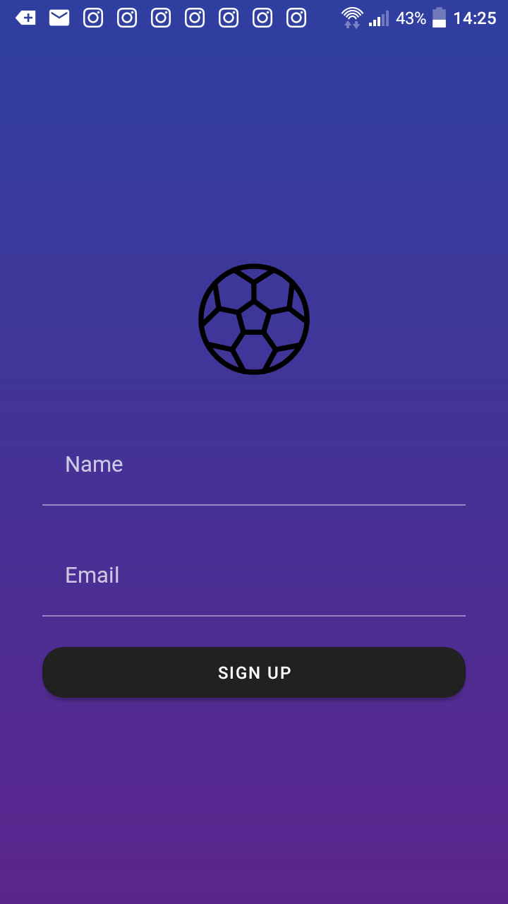
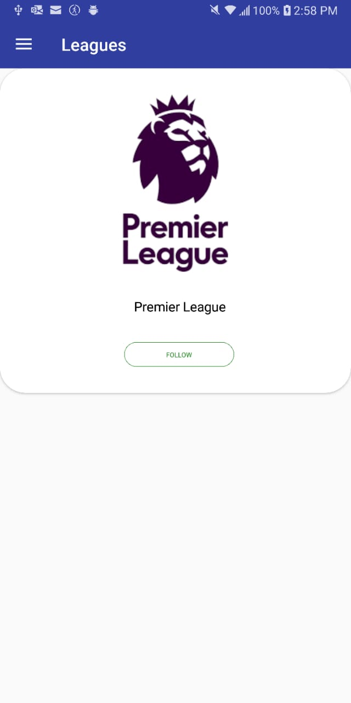
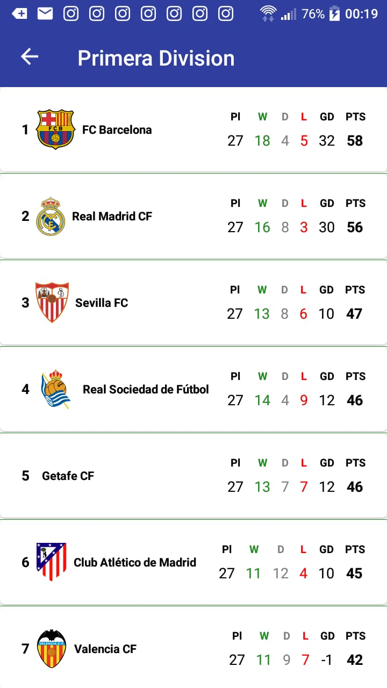
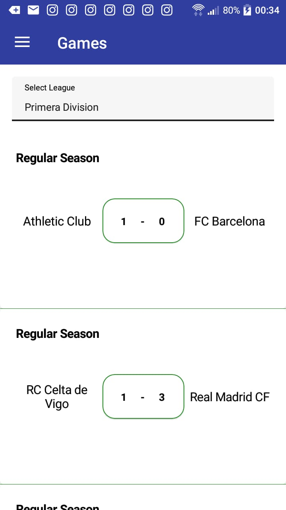
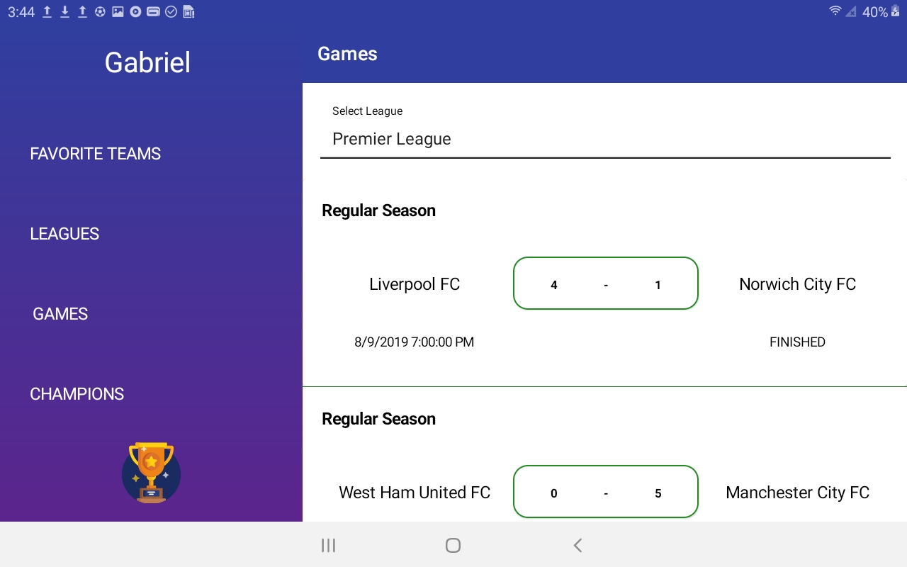
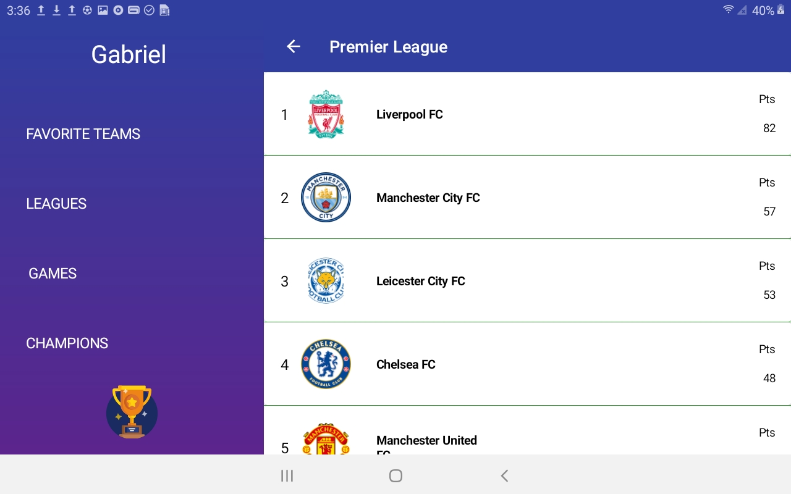
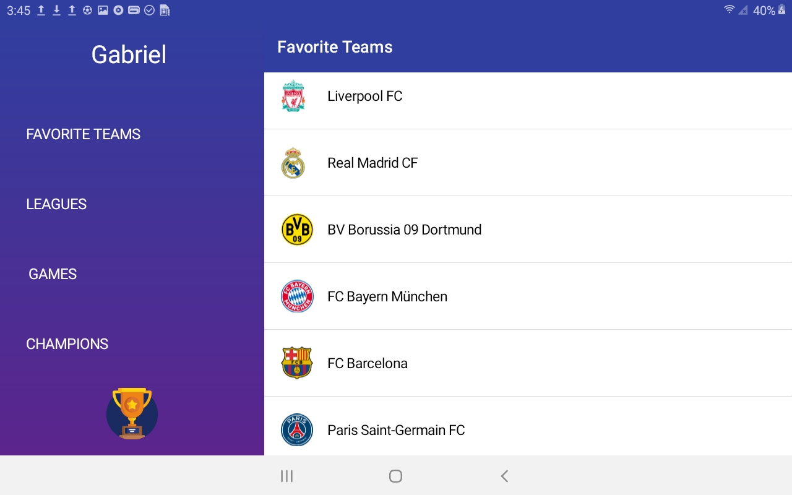
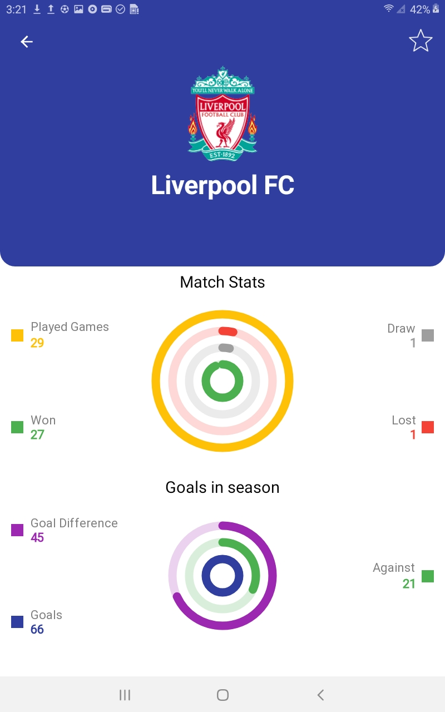

# Xport

## Xport is a simple application about soccer showing data from leagues and teams.
## You can see:
* List of Leagues
* List of matches
* List of teams from differents leagues
* League Standings

## Development
Xport was built using the Xamarin Forms framework in conjuction with the Prism framework following the MVVM pattern.

# Screenshots

## Pictures from Phone

## Pictures from Tablet

## Libraries and Dependencies
* Xamarin.Forms
* Prism.Unity.Forms
* Newtonsoft.JSON
* PropertChanged.Fody
* Refit
* Sqlite
* FFImageLoading.Forms.Svg
* Xamarin.Forms.PancakeView
* Com.Airbnb.Xamarin.Forms.Lottie
* Microcharts.Forms
* XForm.Plugin.AnimationNavigationPage
* Xamarin.Forms.Visual.Material
